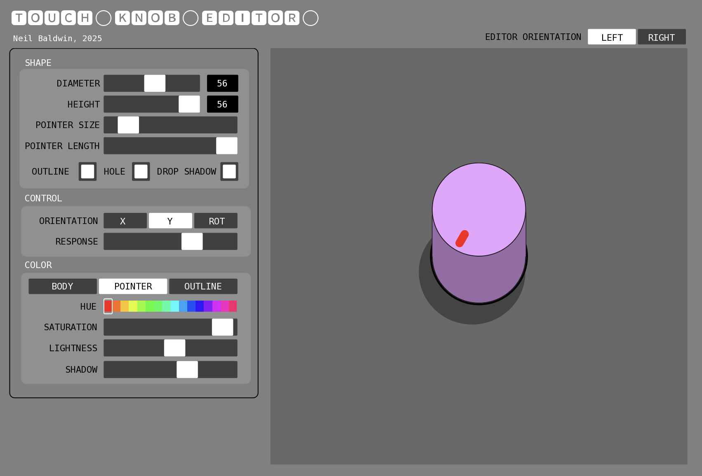

# TOUCH-KNOB-EDITOR
An editor in Touch OSC for creating modular-style knobs that you can use in your own Touch OSC projects.

## A What?!

As a continuation of my  project and prompted by a fellow Touch OSC obsessive, I created a visual editor in Touch OSC that lets you design custom modular-style knobs easily and quickly. Once you've created a masterpiece you can go back into Edit mode in Touch OSC and copy-and-paste the knob into your own projects. Once created they exist and function as a standalone object. You can also add messages to them (OSC, MIDI, local) like other objects.

## When you say "custom" what can you customise?

* Diameter
* Height
* Pointer diameter
* Pointer length
* Outline (stroke)
* Drop shadow
* Color (hue, saturation and lightness) of knob, pointer and outline
* Shadow brightness
* Control orientation (drag in X axis, Y axis or rotational axis)
* Control response (speed/precision when dragging to change value)
* Left or right-handed UI (editor option)

## How do I get it?

Just download the .tosc file, TOUCH-KNOB-EDITOR.tosc, open it in Touch OSC.

## How do I use it?

Let's look again at the UI.

Starting from the top:

---

### `SHAPE`
This section determines the geometry of the knob.

`DIAMETER`
This sets the size of the knob. You can set the size anywhere between 5 and 100 pixels.

`HEIGHT`
This sets the height of the pseudo-3D aspect of the knob. The maximum height is limited by the Diameter of the knob. When the height is 0 the knob just appears *flat*

`POINTER SIZE`
This sets the diamter or width of the knob pointer.

`POINTER LENGTH`
You can also extrude the Pointer to make a short line-style pointer. This sets the length. The maximum length is related to the Pointer Size.

`OUTLINE`
When on, a thing outline or stroke is drawn around the whole knob.

`HOLE`
When on, a black circle is drawn around the base of the knob to give the impression it appears out of a cutout hole.

`DROP SHADOW`
When on, a pseudo-shadow is cast from the knob to emphasise the 3D look.

---

### `CONTROL`
This section determins how the knob is controlled/moved.

`ORIENTATION` The knob can be controlled (moved) in one of three ways: dragging in the X axis, the Y axis or using a rotational movement.

`RESPONSE`
This sets the relative response when you move/rotate the knon. Lower values give a slower but more accurate movement, higher values move the knob quicker but with less accuracy. This is also useful if you have a particularly large or small knob so that you can control the movement speed.

---

### `COLOR`
The controls in this section determine the various colors of the knob.

`BODY/POINTER/OUTLINE`
This is a selection radio button to choose which component of the knob you want to change the color of. `BODY` is the main colour, `POINTER` is the pointer color and `OUTLINE` is the colour of the outline (if enabled).

`HUE`
This selects the hue of the component. If the color behind the slider is black (or white, or grey) then you need to increase the Saturation and/or Lightness.

`SATURATION`
This sets the saturation level of the Hue. You can move this all the way to the left if you want a greyscale color.

`LIGHTNESS`
This sets the lightness of the hue. Move it all the way to the left for black or all the way to the right for white. And anywhere in between!

`SHADOW`
This sets the brightness of the drop shadow and the shading on the side of the knob. All the way to the right makes the drop shadow transparent.

### UI Orientation

The `[LEFT|RIGHT]` button at the top-right of the editor window swaps which side the editor controls are on. Handy if you're left-handed. Or right-handed. Handy.

## I made an amazing knob, now what!?

First the simple stuff: using your new fresh knob in your own projects.

Exit "play mode" (or whatever it's called) then click on the knob inside the knob editor window and copy-and-paste it wherever you want. That's it really!

### Using you new knob to send messages and stuff...

It might be obvious (or not) that the knobs are made up of quite a few separate components (stock Touch OSC objects) that are arranged and manipulated to simulate a rotary modular-style knob. This means your knob is actually a Touch OSC Group that contains all the other parts.

A downside of Touch OSC (currently) is that you can't add messages to a Group object. Well, you can, but Group objects only have one kind of interraction (Touch) so you can't capture any meaningful interaction data if you want to use it to control other objects or send messages.

The solution is to add the messages to an object *inside* the knob group. This is also how you'd make a local connection - by connecting an object from inside the knob group to whichever object in your project you want to send messages to. This sounds way more complicated than it actually is.

For your convenience I added a special object inside of the knobs just for this purpose.

"Open" up the knob by double-clicking it. Inside the knob, at the top of the object stack is a Fader named "OUTPUT_FADER". This is the object you should add messages to or use the eyedropper to target local objecs (inside your project).

### Summary

I think that's about it!

The code is fairly well commented so should be fairly easy to follow if you want to have a dig around or make your own modifications.

### Usage

Feel free to use the code or techniques however you like. If you appreciate my work or you find it useful or you've learned something from it, please consider buying my one of those digital coffees. A real one would be nice but this is the world we live in.

:pray:
